# 拆书导入功能完整流程文档

## 概述

拆书导入功能是一个智能化的TXT小说导入系统，能够自动解析文本内容、识别章节结构、生成项目信息、创建角色关系和世界观设定。本文档详细介绍了整个系统的工作流程和实现细节。

## 系统架构

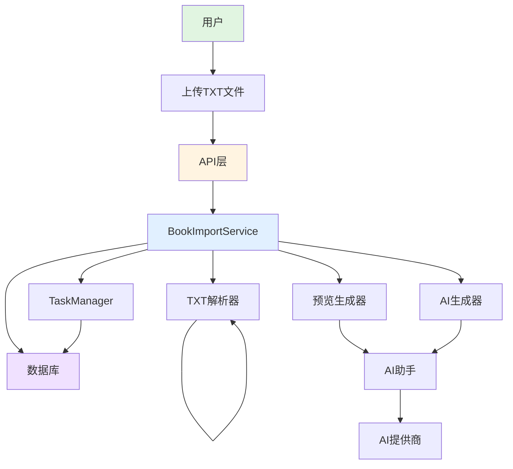

## 核心组件

### 1. BookImportService（导入服务）
**职责**：协调整个导入流程，管理任务状态，处理用户请求

**主要功能**：
- 任务创建和管理
- 异步流程控制
- 错误处理和重试机制
- 数据持久化

### 2. TaskManager（任务管理器）
**职责**：管理导入任务的生命周期和状态

**任务状态流转**：
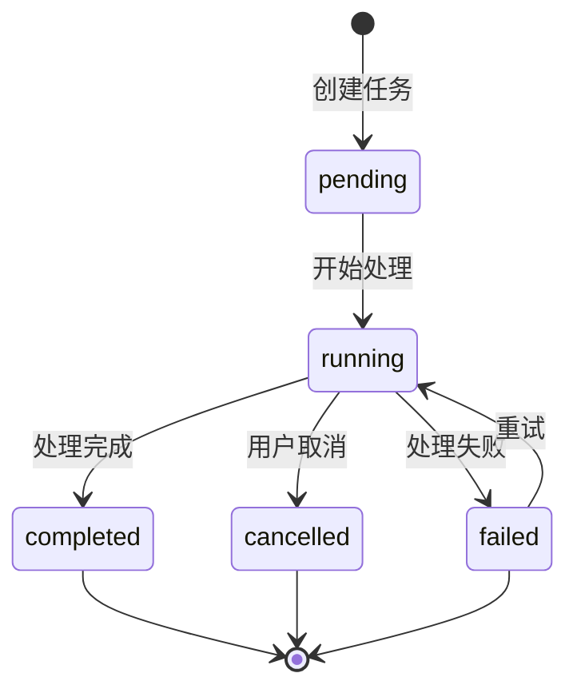

### 3. TXT解析器（txt-parser）
**职责**：处理原始文本，识别章节结构

**处理流程**：
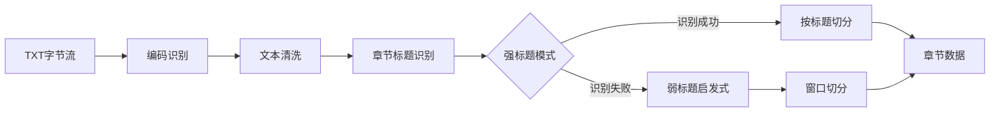

**编码识别优先级**：
1. UTF-8 BOM
2. UTF-8
3. GB18030
4. GBK
5. Big5
6. UTF-8容错模式

### 4. 预览生成器（preview-generator）
**职责**：生成导入预览，包括项目信息和章节大纲

**生成流程**：
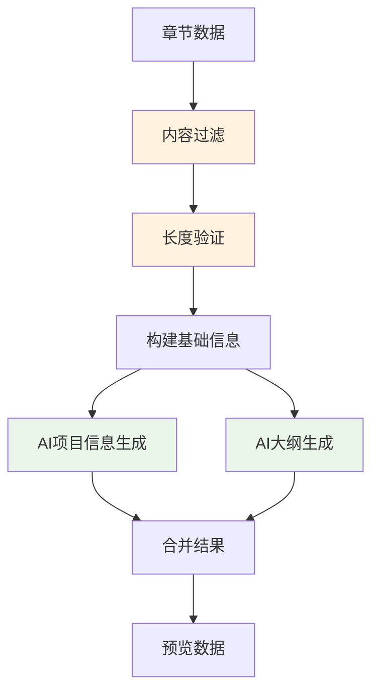

### 5. AI生成器（ai-generators）
**职责**：使用AI生成角色、关系、世界观和事件信息

**生成流程**：
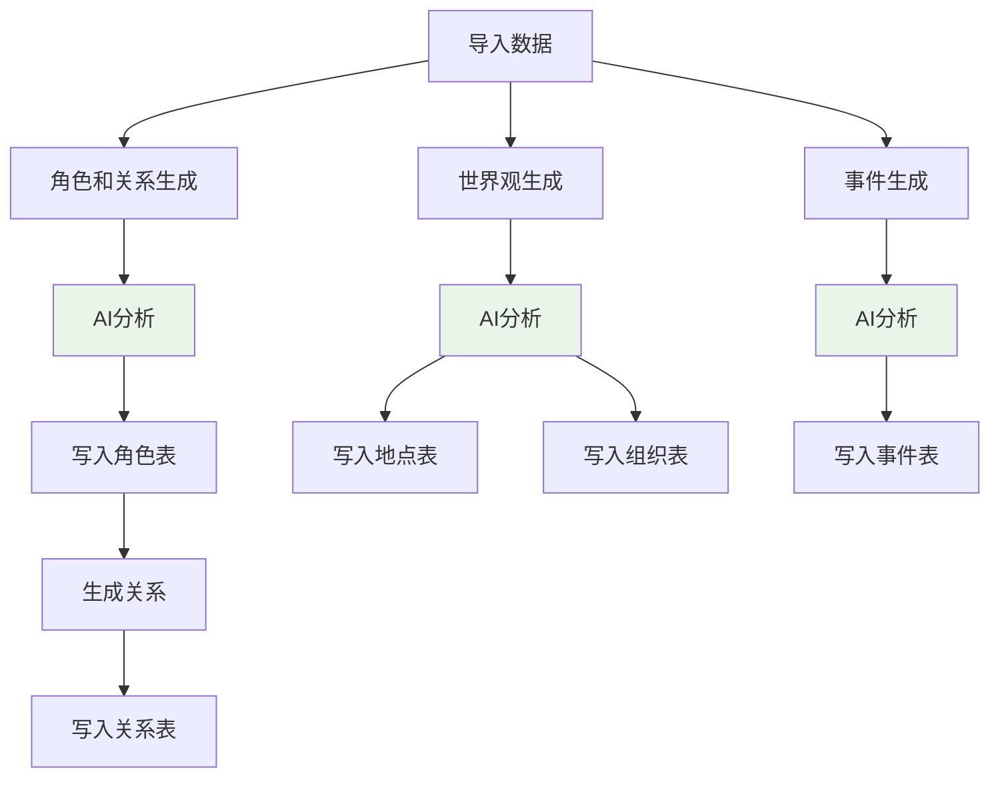

## 完整导入流程

### 阶段一：文件上传与任务创建

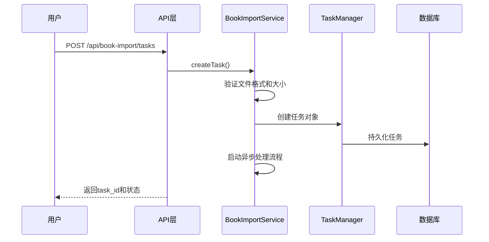

**关键验证点**：
- 文件格式：仅支持.txt
- 文件大小：最大50MB
- 导入模式：append（追加）或overwrite（覆盖）

### 阶段二：文本解析与章节识别

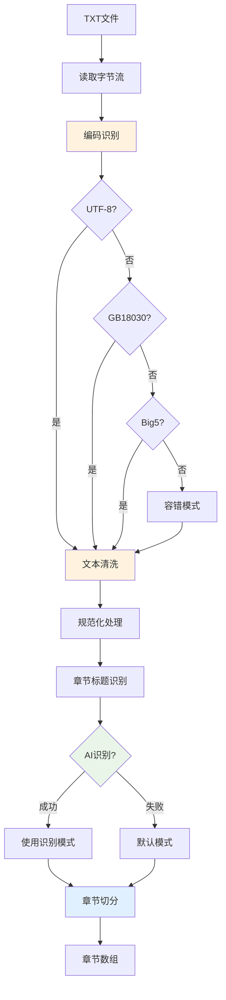

**文本清洗规则**：
- 统一换行符（\r\n → \n）
- 移除BOM标记
- 全角空格转半角
- 清理多余空行（最多保留3个）

**章节识别策略**：
1. **AI智能识别**：分析样本，识别常见标题模式
2. **强标题模式**：正则匹配标准章节标题格式
3. **弱标题启发式**：独立短行 + 前后空行
4. **兜底窗口切分**：3000-5000字智能分段

### 阶段三：预览生成

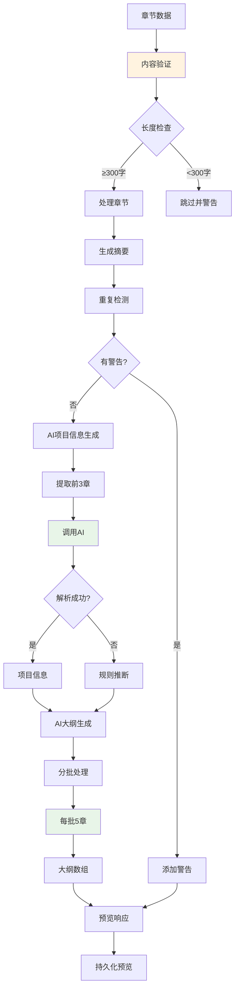

**AI项目信息生成**：
- **输入**：前3章内容（每章2000字）
- **输出**：标题、简介、主题、类型、叙事视角、目标字数
- **提示词模板**：`BOOK_IMPORT_REVERSE_PROJECT_SUGGESTION`

**AI大纲生成**：
- **批次大小**：每批5章
- **输入**：完整章节内容
- **输出**：结构化大纲（场景、角色、情节要点）
- **提示词模板**：`BOOK_IMPORT_REVERSE_OUTLINES`

### 阶段四：用户确认与导入应用

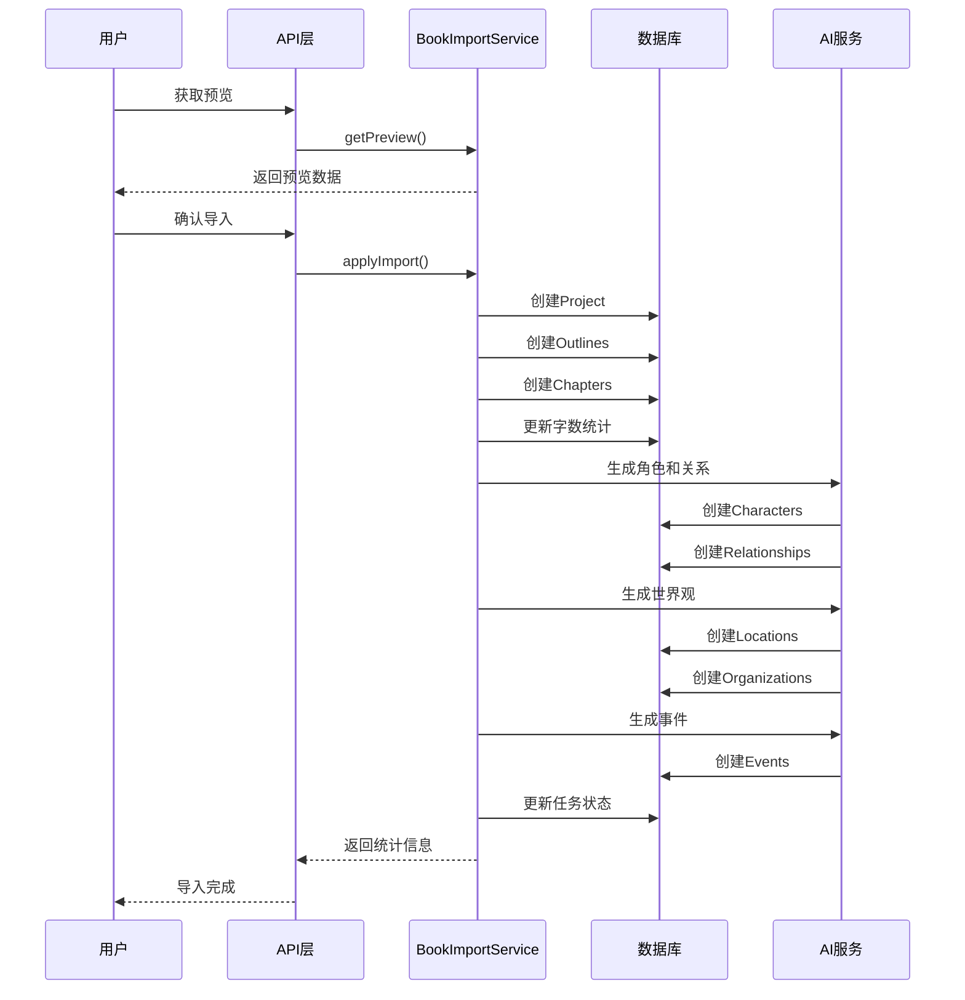

### 阶段五：AI内容生成详解

#### 5.1 角色和关系生成

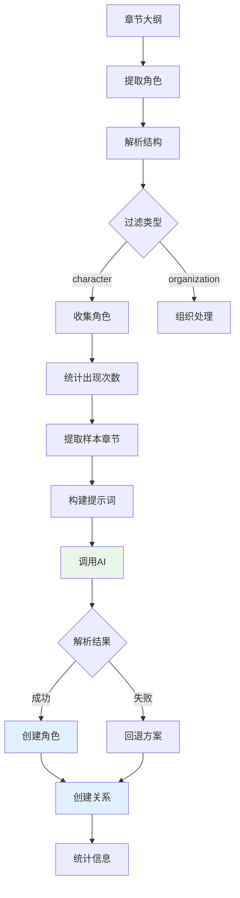

**角色提取逻辑**：
1. 从大纲结构中提取 `type: "character"` 的实体
2. 统计角色在各章节的出现频率
3. 选择前20个主要角色
4. AI生成详细角色档案（外貌、性格、背景）

**关系生成策略**：
- **AI模式**：基于章节内容分析角色互动
- **回退模式**：基于共同出现频率创建关系
- **强度计算**：共同出现次数 × 10（最高60）

#### 5.2 世界观生成

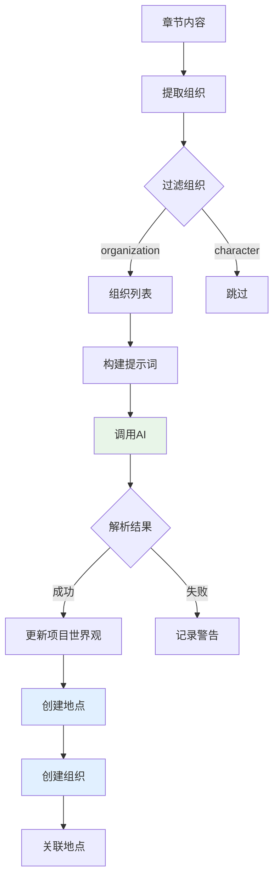

**世界观更新字段**：
- `worldTimePeriod`：时代背景（200-500字）
- `worldLocation`：地理环境（200-500字）
- `worldAtmosphere`：氛围基调（150-400字）
- `worldRules`：核心规则（200-500字）

**地点创建**：
- 名称、类型、描述
- 气候特点、人口规模
- 重要性评分（1-100）

**组织创建**：
- 名称、类型、描述
- 领导者、规模、影响力
- 关联地点

#### 5.3 事件生成

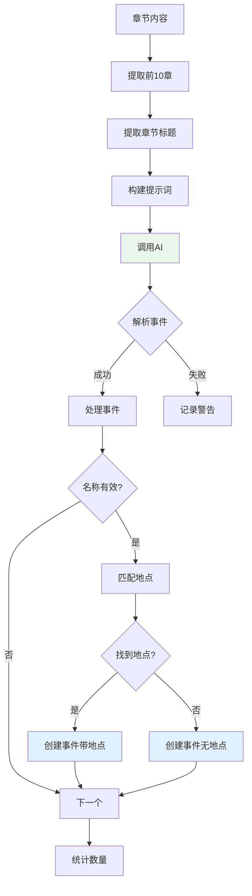

**事件识别标准**：
- 推动剧情发展的重要节点
- 角色成长的关键时刻
- 世界观揭示的重大事件
- 剧情转折的核心冲突

**事件字段**：
- 名称、类型（战斗、会面、发现、转折等）
- 详细描述（200-500字）
- 故事时间、重要性评分
- 关联地点

## 错误处理与重试机制

### 错误分类

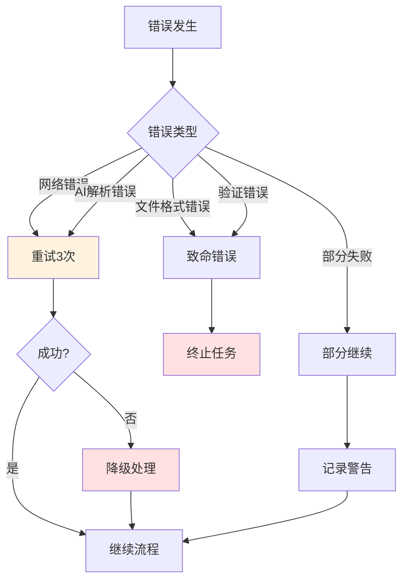

### 重试策略

**AI调用重试**：
- 最大重试次数：3次
- 重试间隔：指数退避
- 失败后降级：规则推断

**章节大纲重试**：
- 单批失败不影响其他批次
- 失败批次使用规则大纲占位
- 用户可手动重试失败章节

## 数据库持久化

### 任务表（BookImportTask）

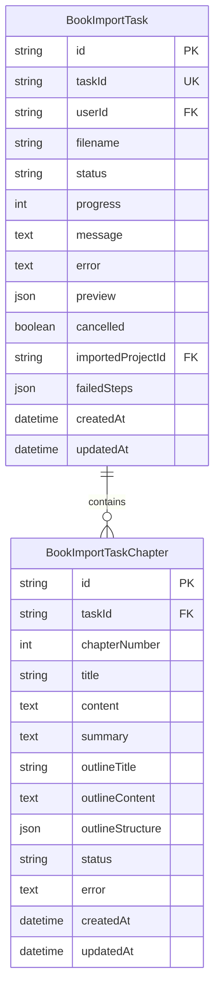

### 项目关系图

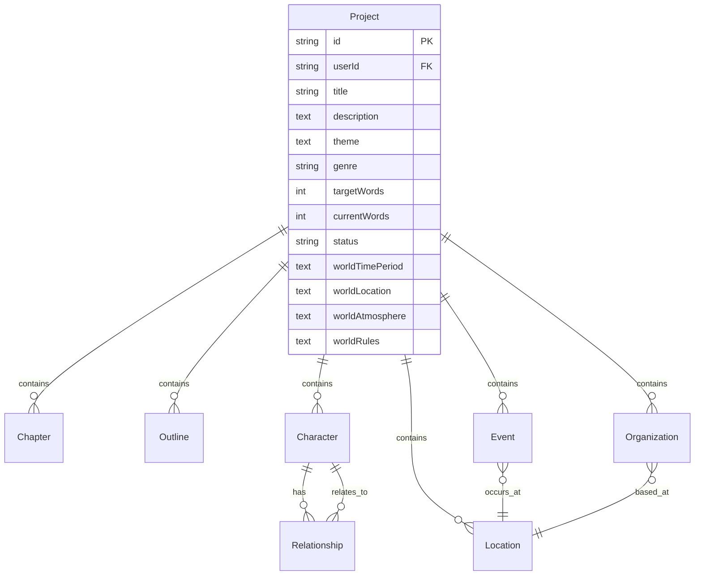

## 性能优化

### 内存管理
- 流式处理大文件
- 分批处理章节（每批5章）
- 及时释放已处理数据

### 并发控制
- 单用户单任务处理
- 任务队列管理
- 资源限制保护

### 缓存策略
- 任务状态内存缓存
- 数据库持久化备份
- 预览数据分页加载

## 统计信息

导入完成后返回的统计数据包括：

```typescript
{
  chapters: number,           // 章节数量
  outlines: number,          // 大纲数量
  generated_world_building: number,  // 世界观元素数量
  generated_careers: number,  // 职业数量
  generated_entities: number, // 实体总数
  generated_events: number    // 事件数量
}
```

## 警告系统

### 警告级别
- **info**：信息性提示
- **warning**：需要注意的问题
- **error**：严重的错误

### 常见警告代码
- `chapters_filtered_too_short`：过短章节被过滤
- `chapter_too_long`：章节内容过长
- `duplicate_chapter_title`：重复章节标题
- `outline_ai_partial_failed`：部分大纲生成失败

## 扩展性设计

### 新增AI生成步骤
1. 在 `ai-generators.ts` 添加生成函数
2. 在 `prompts.ts` 添加提示词模板
3. 在 `applyImport()` 中调用新函数
4. 更新统计信息

### 支持新的文件格式
1. 扩展文件验证逻辑
2. 添加专用解析器
3. 统一章节数据结构
4. 更新错误处理

## 总结

拆书导入功能通过智能AI处理和多层容错机制，实现了从TXT文件到完整小说项目的自动化转换。系统具有良好的扩展性和稳定性，能够处理各种格式的文本内容，为用户提供便捷的创作辅助工具。

**核心优势**：
- 🤖 AI智能识别和生成
- 🔄 完善的错误处理和重试
- 📊 详细的进度反馈
- 🎯 精准的章节切分
- 🌍 丰富的世界观生成
- 👥 完整的角色关系网络
- ⚡ 重要事件提取

**技术亮点**：
- 流式处理大文件
- 分批AI调用优化
- 内存数据库双缓存
- 智能降级策略
- 完善的单元测试覆盖
