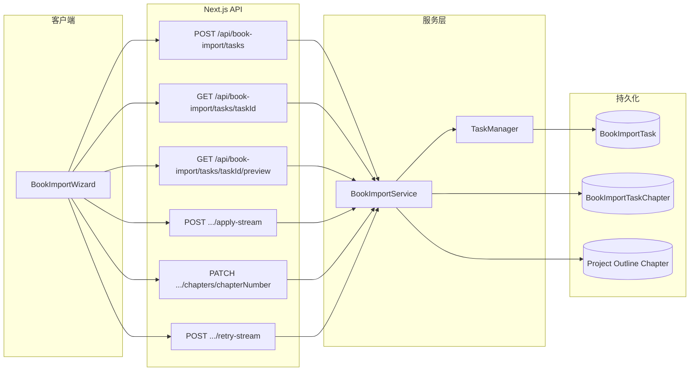
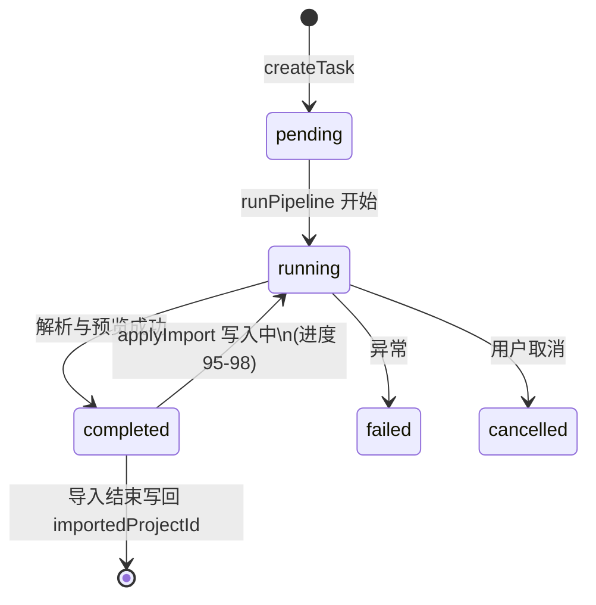
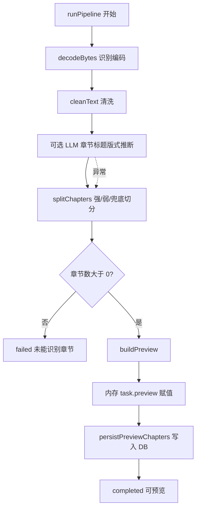
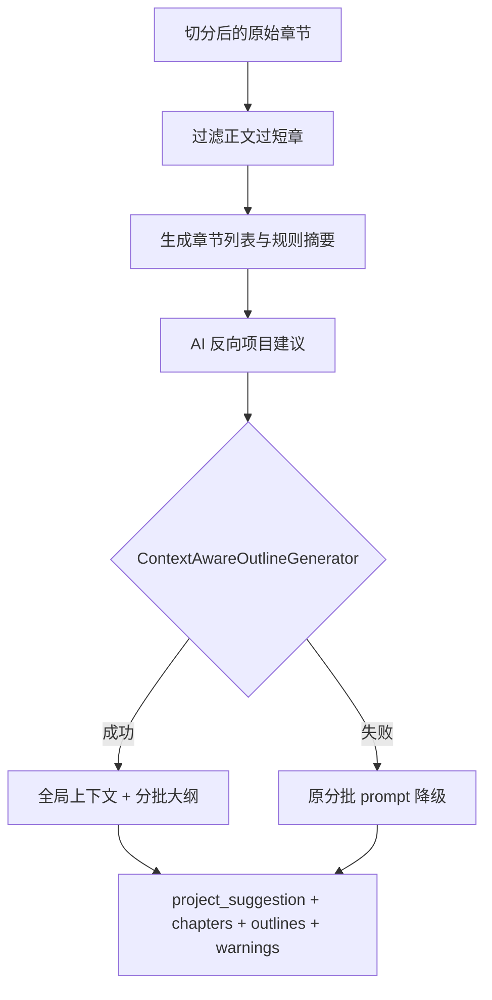
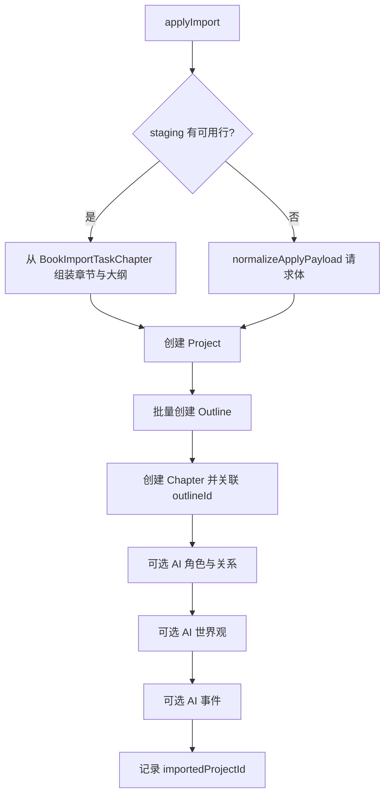

# 拆书导入功能逻辑说明

本文档说明「拆书导入」从上传 TXT 到生成新项目的端到端流程，对应实现主要在 `BookImportWizard`（前端）、`book-import` 相关 API 路由，以及 `book-import.service.ts` 与 `src/lib/book-import/` 下的解析与 AI 模块。

---

## 1. 功能目标与约束

- **输入**：纯文本 `.txt`，最大约 **50MB**（`MAX_TXT_BYTES`）。
- **输出**：新建一个 **Project**，并写入 **Outline**（与章节一对一，`outlineMode: one-to-one`）、**Chapter** 正文；可选地通过 AI 补充角色关系、世界观、事件等。
- **当前产品约束**（API 层硬编码）：仅支持 **新建项目** 导入，不接受已有 `project_id` 的追加导入（见 `src/app/api/book-import/tasks/route.ts`）。
- **任务模型**：每个上传对应一个异步 **任务**（`task_id`），状态为 `pending` → `running` → `completed` | `failed` | `cancelled`；进度与文案通过轮询 `GET /api/book-import/tasks/[taskId]` 展示。

---

## 2. 整体架构（用户视角）

---

## 3. 任务生命周期与存储

`TaskManager` 在进程内用 `Map` 缓存任务；每次状态变更会 **upsert** 到 `BookImportTask`（JSON 字段存完整 `preview` 摘要等）。**服务器重启**后内存丢失，可从数据库 **hydrate** 回内存（`getOrThrow`）。

解析完成后，除 `preview` JSON 外，还会把每章写入 **`BookImportTaskChapter`（staging 表）**，用于：

- 预览 **分页**（按章从 DB 拉取，避免超大 JSON）；
- 单章 **PATCH** 编辑与 **失败章节重试**。

---

## 4. 解析流水线 `runPipeline`

`createTask` 校验文件后立即 `persist`，再以 **fire-and-forget** 方式调用 `runPipeline`（不阻塞 HTTP 响应）。

主要步骤：

1. **解码**：`decodeBytes` — BOM、依次尝试 utf-8 / gb18030 / gbk / big5，失败则 utf-8 容错。
2. **清洗**：`cleanText` — 统一换行、去 BOM、压缩多余空行等。
3. **章节标题推断（可选 AI）**：从正文抽样 → LLM 返回预设或自定义规则 → 校验后得到 **强标题正则** `headingStrongPatterns`；失败则仅用内置规则。
4. **切章**：`splitChapters` — **强模式**（默认含「第…章」、Chapter N 等）+ **弱模式**（短行、前后空行等启发式）；若无任何标题则 **按字数窗口** `fallbackSplit`。
5. **构建预览**：`buildPreview`（见下一节）。
6. **落库 staging**：`persistPreviewChapters` 写入 `BookImportTaskChapter`；任务状态 `completed`。

---

## 5. 预览构建 `buildPreview`

1. **过滤过短章**：正文 trim 后少于 `BOOK_IMPORT_MIN_CHAPTER_CONTENT_CHARS`（300）的章节丢弃，并产生 `warnings`（全被过滤则为 error 级别）。
2. **章节列表**：为每章生成 `summary`（规则摘要，见 `metadata.buildSummary`），重排 `chapter_number`，检测重复标题、超长正文等告警。
3. **反向项目信息**：`generateReverseProjectSuggestion` — 取前几章片段调 LLM，得到标题、简介、主题、类型、叙事视角、目标字数等；失败则用 `buildFallbackProjectSuggestion`。
4. **反向大纲**：优先 **`ContextAwareOutlineGenerator`**（全局分析 + 每批 5 章带上下文递进）；失败则降级为 **`generateReverseOutlinesFallback`**（固定 prompt 分批 5 章）。单章/批次失败会记录 `failedChapterErrors`，staging 中对应行 `status: failed`，预览可提示并重试。

**上下文感知大纲**（概要）：`GlobalContextManager` 先做全书级分析，再按批调用 `EnhancedPromptBuilder` 组装带上下文的提示词；每批结果回写上下文，供后续批次使用（详见 `context-aware-outline-generator.ts`、`context-manager.ts`）。

---

## 6. 预览 API 与分页

`getPreviewPage` 行为：

- 若存在 **staging 行**（`bookImportTaskChapter.count > 0`）：从 DB 分页读取章节与大纲字段，并返回 `staging.failed_chapter_numbers`。
- 否则：从内存/JSON 的 `task.preview.chapters` 做 **slice 分页**（兼容旧数据路径）。

查询参数：`page`、`pageSize`（上限 200）。

---

## 7. 确认导入 `applyImport`

前置条件：任务 `status === completed`。

数据来源：

- 若 DB 中存在 **非 failed** 的 staging 行：以 **DB 为准**（用户编辑已反映在 staging）。
- 否则：使用请求体中的 `chapters` / `outlines`，经 `normalizeApplyPayload` 重排章节号、对齐大纲条数与 `outline_title`。

写入顺序：

1. `deriveWorldSettings` 从项目建议与章节推导世界观字段。
2. `project.create`（含 `outlineMode: one-to-one'` 等）。
3. 按顺序 `outline.create`，建立 `title → outlineId` 映射。
4. 按 `chapter_number` 排序创建 `chapter`，关联 `outlineId`，累计 `currentWords`。
5. **后置 AI**（失败仅打日志，不阻断导入）：
   - `generateCharactersAndRelationships`
   - `generateWorldBuilding`
   - `generateEvents`
6. 设置 `task.importedProjectId` 并 `persist`。

前端 **`apply-stream`** 用 SSE 推送进度与最终结果（`formatSseData`）。

---

## 8. 前端向导要点（`BookImportWizard`）

- 选文件 → `POST` 创建任务 → 轮询状态直至 `completed` / `failed`。
- 拉取预览（分页），可展开章节编辑；编辑通过 **debounce** 后 `PATCH` 更新 staging。
- 对 `failed` 章节可勾选，通过 **`retry-stream`** 触发服务端重试逻辑（将失败行恢复为 `ready` 等，具体见 `retryFailedChapters`）。
- 确认导入走 **`apply-stream` SSE**，成功后跳转章节列表。

---

## 9. 关键文件索引

| 职责 | 路径 |
|------|------|
| 服务编排、流水线、导入事务 | `src/services/book-import.service.ts` |
| 任务内存 + DB 同步 | `src/lib/book-import/task-manager.ts` |
| TXT 解码/清洗/切章 | `src/lib/book-import/txt-parser.ts` |
| 章节标题 LLM 推断 | `src/lib/book-import/chapter-heading-inference.ts` |
| 预览与反向项目/大纲 | `src/lib/book-import/preview-generator.ts` |
| 上下文感知大纲 | `src/lib/book-import/context-aware-outline-generator.ts` |
| 导入后角色/世界观/事件 | `src/lib/book-import/ai-generators.ts` |
| 创建任务 | `src/app/api/book-import/tasks/route.ts` |
| 预览分页 | `src/app/api/book-import/tasks/[taskId]/preview/route.ts` |
| SSE 导入 | `src/app/api/book-import/tasks/[taskId]/apply-stream/route.ts` |
| 向导 UI | `src/components/book-import/book-import-wizard.tsx` |
| 数据模型 | `prisma/schema.prisma`（`BookImportTask`、`BookImportTaskChapter`） |

---

## 10. AI 调用说明

预览与导入阶段的 LLM 均通过 `callWithJsonObject` / `callWithJsonArray`（`ai-helpers.ts`），内部应走 **`completeWithUserOrEnv`** 体系，以支持用户级 API 配置（参见仓库 `CLAUDE.md`）。

---

*文档与代码同步日期：以仓库当前实现为准。*
